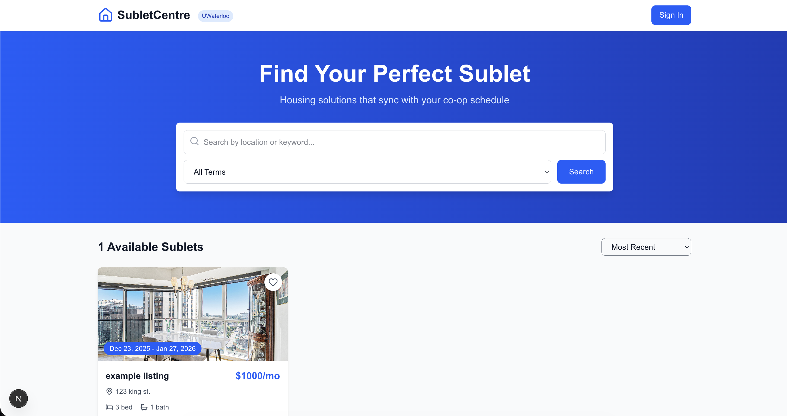
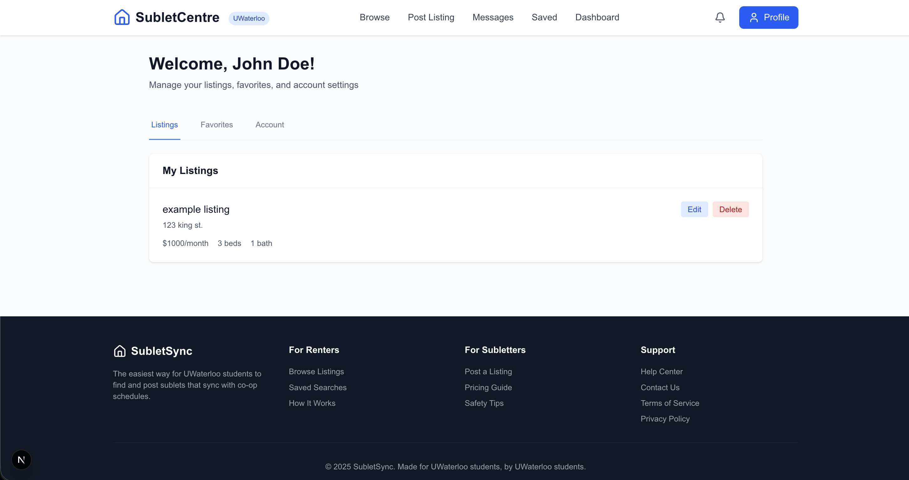
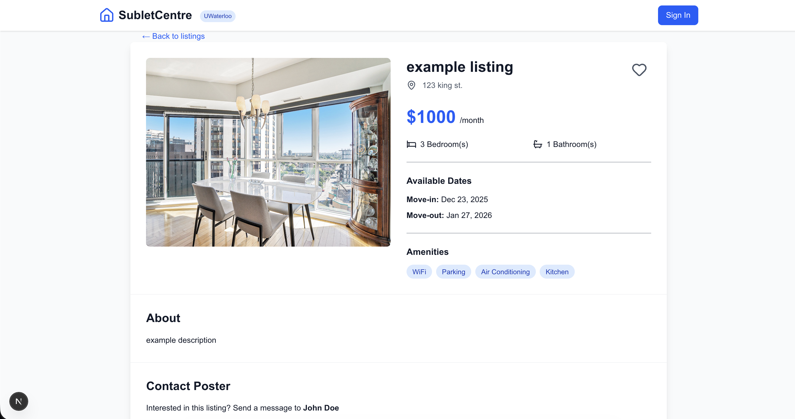
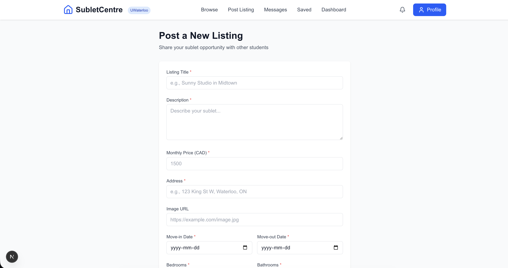

# Sublet Centre

A modern web application for finding and posting rental sublets made for students at the University of Waterloo. Users can browse listings, save favourites, post their own rentals, and communicate with other users.

## Images






## Features

-   **Browse Listings**: Search and filter rental sublets by location, price, amenities, and move-in/out dates
-   **Post Listings**: Create and manage your own rental listings with photos and detailed descriptions
-   **Save Favourites**: Bookmark listings you're interested in
-   **Messaging**: Communicate directly with listing posters and interested renters
-   **Notifications**: Real-time updates on inquiries and messages
-   **User Dashboard**: Manage your profile, listings, and saved properties
-   **Authentication**: Secure user registration and login

## Tech Stack

-   **Frontend**: Next.js 14, React, TypeScript, Tailwind CSS
-   **Backend**: Next.js API Routes
-   **Database**: PostgresSQL, Drizzle ORM, Supabase
-   **Authentication**: Supabase Auth
-   **Icons**: Lucide React

## Project Structure

```
sublet-centre/
├── app/
│   ├── api/              # API routes
│   ├── auth/             # Authentication pages
│   ├── dashboard/        # User dashboard
│   ├── listings/         # Listing detail pages
│   ├── messages/         # Messaging interface
│   ├── notifications/    # Notifications page
│   ├── post-listing/     # Create/edit listings
│   ├── saved/            # Saved listings page
│   └── page.tsx          # Home page
├── components/
│   ├── dashboard/        # Dashboard components
│   ├── home/             # Home page components
│   ├── layout/           # Layout components (Header, Footer)
│   └── listings/         # Listing components
└── lib/                  # Utilities and helpers
```

## API Routes

### Listings

-   `GET /api/listings` - Get all listings
-   `GET /api/listings/[id]` - Get a specific listing
-   `POST /api/listings` - Create a new listing
-   `PUT /api/listings/[id]` - Update a listing
-   `DELETE /api/listings/[id]` - Delete a listing

### Messages

-   `GET /api/messages` - Get all messages
-   `POST /api/messages` - Send a message

### Notifications

-   `GET /api/notifications` - Get all notifications
-   `DELETE /api/notifications/[id]` - Delete a notification

## Usage

### For Renters

1. Browse available listings on the home page
2. Use the search bar to filter by location or amenities
3. Save listings you're interested in to your saved list
4. Click a listing to view details and contact the poster
5. Message posters directly to inquire about availability

### For Listers

1. Sign up and navigate to "Post Listing"
2. Fill in rental details (price, dates, amenities, photos)
3. Manage your listings from the dashboard
4. Respond to inquiries from interested renters
5. Receive notifications when users contact you

## Future Enhancements

-   Real distance calculation based on user location
-   Map integration for listing locations
-   Payment processing for listings
-   User ratings and reviews
-   Advanced filtering options
-   Image gallery improvements
-   Email notifications

## Contributing

Contributions are welcome! Please feel free to submit a Pull Request.

## Support

For issues and questions, please open an issue on the GitHub repository.
